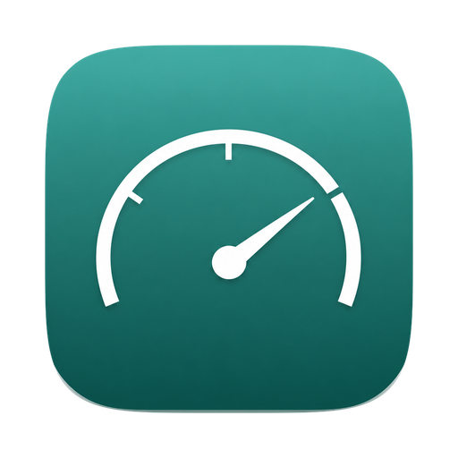

<div align="center">



# Glyphline

**Know what your agents are spending — before you run out.**

[](#requirements)
[](#building-from-source)
[](#requirements)
[](#building-from-source)

A native macOS menu bar app that watches your Claude quota windows, prices what
your Claude Code sessions actually cost, and shows you which agents are sitting
there waiting for an answer.

</div>

---

## Why?

If you run more than one Claude Code session, two questions come up constantly.

**"How close am I to the limit?"** — a percentage does not answer that.
*Empty in 1h 40m* does.

**"Which of these is waiting on me?"** — with six terminals open, the one that
finished four minutes ago and is quietly blocked on a question looks exactly
like the five still working.

Glyphline answers both from the menu bar, and reads your local Claude Code
transcripts to tell you what all of it would have cost on the API.

## Highlights

- 📊 **Quota windows that show pace, not just a number** — every account's
  5-hour and weekly windows side by side, each with a marker for where an even
  burn would have you by now. Bar past the marker means you are spending faster
  than the window allows.
- 💸 **What it would have cost** — every model the pricing catalogue knows,
  ranked **by cost rather than by volume**, so a little Fable outranks a lot of
  Haiku. That is usually the thing worth seeing.
- 📈 **Daily usage, stacked by model** — click any bar for that day's breakdown.
- 🏢 **The Agentverse** — your running sessions as an isometric office. Each
  agent sits at a desk with a crystal above their head: green working, **amber
  and pulsing means it is waiting on you**. Blocked agents get up and wander off
  to the break room, so *"three people in the break room"* reads across a room
  without reading a word.
- 🌅 **Lit by your own sky** — the office windows carry the real sun for your
  timezone and the real weather at your location. Dawn is orange, midnight is
  dark, rain is grey.
- 🟩 **Or a datastream, if you prefer an instrument to a place** — one lane of
  falling glyphs per session, subagents as tributaries feeding it, and a lane
  that freezes and glitches amber when it needs you.
- 🔒 **Local by default** — transcripts are read on your Mac and never leave it.
  One outbound request, hourly, for the weather.

## Requirements

- **macOS 26 or later.** Glyphline uses Liquid Glass, which is a macOS 26 API.
- Apple Silicon.
- Claude Code, for the Agentverse and the local cost figures — it reads the
  transcripts under `~/.claude/projects/`.

## Building from source

```bash
git clone git@github.com:marco-scheffler/glyphline.git
cd glyphline
brew install xcodegen          # if you do not have it
xcodegen generate
./scripts/run.sh               # builds Release, installs to ~/Applications, launches
```

`scripts/release.sh` builds a signed, notarised universal app for handing to
someone else. It needs a Developer ID certificate and a stored notary profile.

```bash
xcodebuild test -project Glyphline.xcodeproj -scheme Glyphline -destination 'platform=macOS'
```

## How it works

**Quota windows** come from the Claude API, per account. They are the only thing
that differs between accounts.

**Everything else is machine-wide.** A Claude Code transcript records no marker
of which subscription produced it, and `/login` writes every account into the
same directory — so spend, the daily chart and the model mix are properties of
this Mac rather than of an account. The dashboard says so rather than implying
otherwise.

**Sessions** are discovered by reading the tail of each transcript. A session is
*waiting on you* when its last assistant record stopped for a reason other than
a tool call. Sessions that go quiet for an hour park in the break room, and are
forgotten after 96.

**Cost** is API-equivalent, not money you were charged: what those tokens would
have cost had they gone through the API instead of a subscription.

## Notes

- The Agentverse only runs while its window is on screen — no timer, no
  background polling. Close it and nothing happens.
- Weather comes from [Open-Meteo](https://open-meteo.com), with no account and
  no API key. Your location is derived from your **system timezone**, not from
  CoreLocation, so there is no permission prompt and it works offline. You can
  override it in Settings.

## Built with

Swift 6, SwiftUI, Swift Charts, and [GRDB](https://github.com/groue/GRDB.swift)
— the only package dependency.
